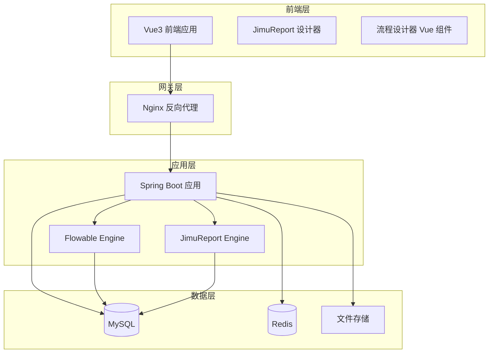
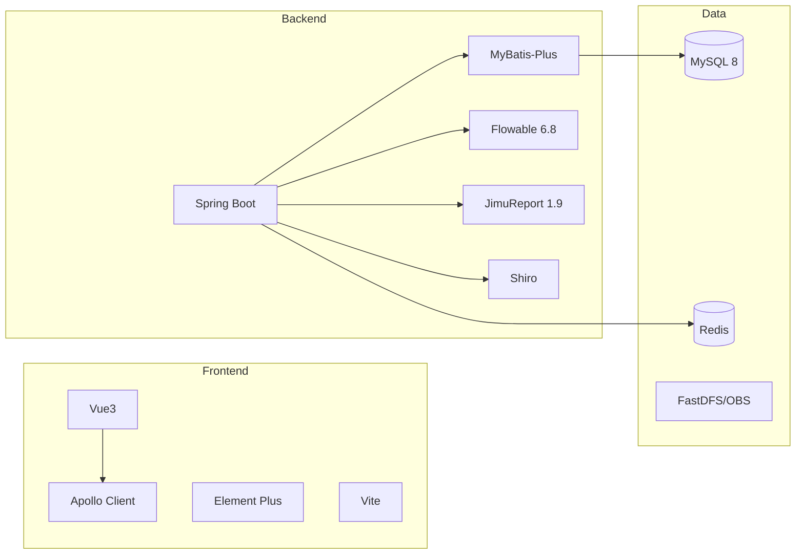
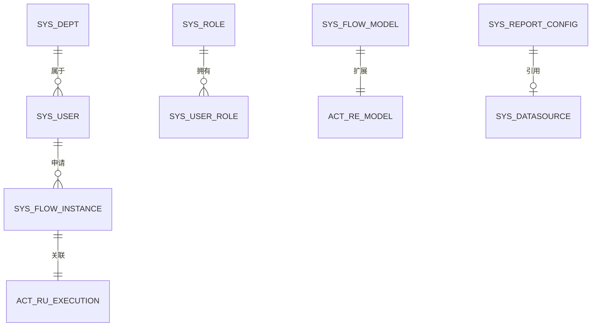
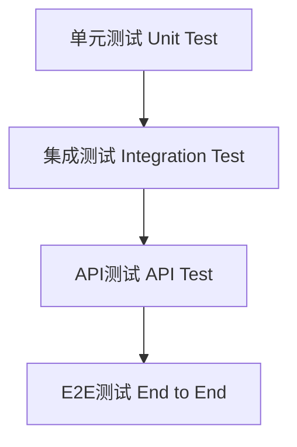
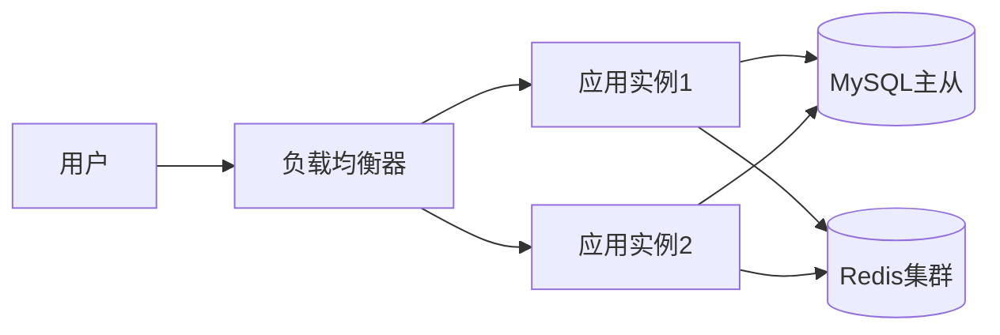

# 基于RuoyiFlowableJimu的应用开发平台

需求名称：2026-03-29-ruoyi-flowable-jimu
更新日期：2026-03-29

## 概述

### 项目背景

RuoYi-Vue-Plus 是基于 RuoYi-Vue 的全面升级版本，专注于分布式集群和多租户场景，采用 Vue3、TS、ElementPlus 构建。Flowable 是流行的开源工作流引擎，支持 BPMN、CMMN、DMN 标准。积木报表（JimuReport）是国产免费报表工具，提供可视化报表设计能力。

本项目旨在整合这三者，构建一个集成了工作流引擎和报表能力的通用应用软件开发框架。

### 技术选型

| 组件 | 技术选型 | 版本 |
|------|---------|------|
| 基础框架 | RuoYi-Vue-Plus | 5.x |
| 流程引擎 | Flowable | 6.8.x |
| 报表组件 | 积木报表 JimuReport | 1.9.x |
| 后端技术 | Spring Boot + MyBatis-Plus | Boot 2.7.x |
| 前端技术 | Vue3 + Element Plus + Vite | Vue 3.4.x |
| 数据库 | MySQL | 8.0 |
| 缓存 | Redis | 7.x |

### 设计目标

1. **模块化设计**：核心功能与业务功能解耦，便于扩展
2. **工作流集成**：Flowable 流程引擎与系统无缝集成
3. **报表能力**：JimuReport 报表设计器集成，支持可视化报表开发
4. **前后分离**：Vue3 前端 + Spring Boot 后端，前后分离架构
5. **多租户支持**：继承 RuoYi-Vue-Plus 的多租户能力

---

## 架构

### 系统架构图



### 模块划分

```
ruoyi-flowable-jimu/
├── ruoyi-modules/              # 独立模块
│   ├── ruoyi-system/           # 系统管理模块
│   ├── ruoyi-flowable/        # Flowable 流程模块
│   └── ruoyi-report/          # 报表模块
├── ruoyi-common/              # 公共模块
│   ├── ruoyi-common-core/    # 核心工具类
│   ├── ruoyi-common-data/     # 数据访问公共部分
│   └── ruoyi-common-security/ # 安全公共部分
├── ruoyi-ui/                   # 前端 Vue3 项目
└── pom.xml
```

### 技术架构



---

## 组件与接口

### 核心组件

#### 1. Flowable 流程模块

**模块职责**：集成 Flowable 引擎，提供流程设计、部署、执行的完整能力

**核心服务**：

| 服务类 | 职责 | 关键方法 |
|--------|------|---------|
| FlowableProcessService | 流程定义管理 | deployProcess, suspendProcess, activateProcess |
| FlowableTaskService | 任务运行时管理 | claimTask, completeTask, delegateTask |
| FlowableInstanceService | 流程实例管理 | startProcess, getProcessInstance, deleteProcess |
| FlowableModelService | 流程模型管理 | createModel, saveModel, getBpmnModel |

**Flowable 配置类**：

```java
@Configuration
public class FlowableConfig {
    
    @Bean
    public ProcessEngineConfiguration processEngineConfiguration(DataSource dataSource, PlatformTransactionManager transactionManager) {
        SpringProcessEngineConfiguration config = new SpringProcessEngineConfiguration();
        config.setDataSource(dataSource);
        config.setTransactionManager(transactionManager);
        config.setDatabaseSchemaUpdate("true");
        config.setAsyncExecutorActivate(true);
        config.setActivityFontName("宋体");
        config.setLabelFontName("宋体");
        config.setAnnotationFontName("宋体");
        return config;
    }
}
```

#### 2. JimuReport 报表模块

**模块职责**：集成积木报表引擎，提供报表设计、渲染、数据查询能力

**核心配置**：

```java
@Configuration
@MapperScan("org.jimureport.*.mapper")
public class JimuReportConfig {
    
    @Bean
    public ReportDBPoolProperties reportDBPoolProperties() {
        return new ReportDBPoolProperties();
    }
}
```

**报表管理服务**：

| 服务类 | 职责 |
|--------|------|
| ReportDesignService | 报表设计管理 |
| ReportRenderService | 报表渲染服务 |
| ReportDataSourceService | 报表数据源管理 |

#### 3. 系统管理模块（扩展自 RuoYi-Vue-Plus）

**核心功能**：

| 功能 | 说明 |
|------|------|
| 用户管理 | 用户CRUD、状态管理、密码策略 |
| 角色管理 | 角色权限分配、数据权限 |
| 菜单管理 | 动态菜单、按钮权限 |
| 部门管理 | 组织架构、树形结构 |
| 岗位管理 | 岗位序列、岗位人员 |
| 租户管理 | 多租户隔离、租户配置 |

### API 接口设计

#### 流程管理接口

| 接口路径 | 方法 | 说明 |
|---------|------|------|
| /flowable/process/definition/list | GET | 流程定义列表 |
| /flowable/process/definition/deploy | POST | 部署流程定义 |
| /flowable/process/instance/start | POST | 启动流程实例 |
| /flowable/process/instance/list | GET | 流程实例列表 |
| /flowable/task/todo/list | GET | 待办任务列表 |
| /flowable/task/complete | POST | 完成任务 |
| /flowable/task/claim | POST | 签收任务 |

#### 报表管理接口

| 接口路径 | 方法 | 说明 |
|---------|------|------|
| /report/design/list | GET | 报表列表 |
| /report/design/get | GET | 获取报表设计 |
| /report/design/save | POST | 保存报表设计 |
| /report/preview | GET | 预览报表 |
| /report/export | GET | 导出报表 |

### 前端组件

#### 流程设计器组件

```vue
<!-- FlowableModelDesigner.vue -->
<template>
  <div class="model-designer">
    <div class="palette">
      <div v-for="item in flowElements" :key="item.type" 
           class="flow-element"
           draggable="true"
           @dragstart="onDragStart(item)">
        {{ item.label }}
      </div>
    </div>
    <div ref="canvas" class="canvas"></div>
    <div class="properties-panel">
      <PropertiesPanel :selected-element="selectedElement" />
    </div>
  </div>
</template>
```

#### 任务办理组件

```vue
<!-- FlowableTaskHandle.vue -->
<template>
  <div class="task-handle">
    <TaskHeader :task="task" />
    <TaskForm :task="task" :formData="formData" />
    <TaskActions :task="task" @complete="handleComplete" />
  </div>
</template>
```

---

## 数据模型

### 核心数据表

#### Flowable 相关表（30张核心表）

| 表名 | 说明 |
|------|------|
| ACT_GE_* | 通用数据表 |
| ACT_RU_* | 运行时数据表 |
| ACT_HI_* | 历史数据表 |
| ACT_RE_* | 流程存储表 |
| ACT_PROCDEF_INFO | 流程定义信息 |

#### 自定义业务表

```sql
-- 流程模型扩展表
CREATE TABLE sys_flow_model (
    model_id          VARCHAR(64)  NOT NULL COMMENT '模型ID',
    model_key         VARCHAR(255) NOT NULL COMMENT '模型标识',
    model_name        VARCHAR(255) NOT NULL COMMENT '模型名称',
    model_category    VARCHAR(255) COMMENT '模型分类',
    model_type        VARCHAR(20)  DEFAULT 'BPMN' COMMENT '模型类型',
    model_content     LONGTEXT     COMMENT '模型内容JSON',
    description       VARCHAR(1000) COMMENT '描述',
    version           INT          DEFAULT 1 COMMENT '版本号',
    tenant_id         BIGINT       DEFAULT 0 COMMENT '租户编号',
    create_dept       BIGINT       DEFAULT 0 COMMENT '创建部门',
    create_by         VARCHAR(64)  COMMENT '创建者',
    create_time       DATETIME     COMMENT '创建时间',
    update_by         VARCHAR(64)  COMMENT '更新者',
    update_time       DATETIME     COMMENT '更新时间',
    PRIMARY KEY (model_id)
) COMMENT '流程模型扩展表';

-- 流程申请主表
CREATE TABLE sys_flow_instance (
    instance_id       VARCHAR(64)  NOT NULL COMMENT '实例ID',
    proc_def_id       VARCHAR(64)  COMMENT '流程定义ID',
    proc_def_name     VARCHAR(255) COMMENT '流程定义名称',
    business_key      VARCHAR(255) COMMENT '业务键',
    business_type     VARCHAR(100) COMMENT '业务类型',
    business_id       VARCHAR(64)  COMMENT '业务ID',
    apply_user        VARCHAR(64)  COMMENT '申请人',
    apply_time        DATETIME     COMMENT '申请时间',
    curr_task_name    VARCHAR(255) COMMENT '当前节点',
    proc_status       VARCHAR(20)  DEFAULT 'RUNNING' COMMENT '流程状态',
    tenant_id         BIGINT       DEFAULT 0 COMMENT '租户编号',
    create_by         VARCHAR(64)  COMMENT '创建者',
    create_time       DATETIME     COMMENT '创建时间',
    PRIMARY KEY (instance_id)
) COMMENT '流程申请主表';

-- 报表配置表
CREATE TABLE sys_report_config (
    report_id         VARCHAR(64)  NOT NULL COMMENT '报表ID',
    report_code       VARCHAR(100) NOT NULL COMMENT '报表编码',
    report_name       VARCHAR(255) NOT NULL COMMENT '报表名称',
    report_type       VARCHAR(20)  COMMENT '报表类型',
    data_source_id    VARCHAR(64)  COMMENT '数据源ID',
    template_content  LONGTEXT     COMMENT '模板内容',
    status            CHAR(1)      DEFAULT '0' COMMENT '状态',
    tenant_id         BIGINT       DEFAULT 0 COMMENT '租户编号',
    create_by         VARCHAR(64)  COMMENT '创建者',
    create_time       DATETIME     COMMENT '创建时间',
    PRIMARY KEY (report_id)
) COMMENT '报表配置表';
```

### ER 关系图



---

## 正确性属性

### 功能正确性

1. **流程引擎正确性**
   - 流程定义部署后能正确创建流程实例
   - 任务能正确分配给指定用户
   - 流程变量能正确传递和持久化
   - 会签、并行网关逻辑正确

2. **报表引擎正确性**
   - 报表设计器保存的模板能正确渲染
   - 数据源连接正确，查询结果准确
   - 导出功能（Excel/PDF/Word）格式正确

3. **系统功能正确性**
   - 用户权限控制正确，数据权限隔离
   - 多租户数据严格隔离
   - 接口幂等性正确实现

### 性能正确性

| 指标 | 目标值 |
|------|--------|
| 流程启动响应时间 | < 500ms |
| 任务查询响应时间 | < 200ms |
| 报表渲染时间 | < 3s（数据量<10万） |
| 并发用户数 | >= 500 |

### 安全正确性

1. **接口安全**
   - 所有接口需认证后访问
   - 敏感接口需授权
   - 防SQL注入、XSS攻击

2. **数据安全**
   - 密码加密存储（BCrypt）
   - 接口数据传输加密（AES+RSA）
   - 数据脱敏能力

---

## 错误处理

### 异常分类

```java
public enum ErrorCode {
    // 系统级异常 1xxxx
    SYSTEM_ERROR("10001", "系统异常"),
    DATA_NOT_FOUND("10002", "数据不存在"),
    
    // 流程异常 2xxxx
    FLOW_NOT_FOUND("20001", "流程不存在"),
    FLOW_ALREADY_DEPLOYED("20002", "流程已部署"),
    TASK_NOT_FOUND("20003", "任务不存在"),
    TASK_ASSIGNEE_ERROR("20004", "任务签收人错误"),
    
    // 报表异常 3xxxx
    REPORT_NOT_FOUND("30001", "报表不存在"),
    REPORT_RENDER_ERROR("30002", "报表渲染失败"),
    DATASOURCE_CONNECTION_ERROR("30003", "数据源连接失败"),
    
    // 权限异常 4xxxx
    UNAUTHORIZED("40001", "未授权"),
    FORBIDDEN("40002", "禁止访问"),
    TOKEN_EXPIRED("40003", "令牌已过期");
}
```

### 全局异常处理

```java
@RestControllerAdvice
public class GlobalExceptionHandler {
    
    @ExceptionHandler(FlowableException.class)
    public AjaxResult handleFlowableException(FlowableException e) {
        log.error("Flowable error: ", e);
        return AjaxResult.error(e.getErrorCode(), e.getMessage());
    }
    
    @ExceptionHandler(ReportException.class)
    public AjaxResult handleReportException(ReportException e) {
        log.error("Report error: ", e);
        return AjaxResult.error(e.getErrorCode(), e.getMessage());
    }
}
```

### 流程错误处理

```java
@Service
public class FlowableErrorHandler {
    
    public void handleBpmnError(String processInstanceId, String errorCode, String errorMessage) {
        RuntimeService runtimeService = processEngine.getRuntimeService();
        runtimeService.createChangeActivityStateBuilder(processInstanceId)
            .moveToActivityIdAndExecute(errorCode, new ExecutionListener() {
                @Override
                public void notify(DelegateExecution execution) {
                    throw new BpmnError(errorCode, errorMessage);
                }
            });
    }
}
```

---

## 测试策略

### 测试分层



### 单元测试

**测试范围**：

| 模块 | 测试类 | 测试内容 |
|------|--------|---------|
| Flowable | ProcessServiceTest | 流程定义部署、流程实例启停 |
| Flowable | TaskServiceTest | 任务签收、完成任务 |
| Report | ReportRenderTest | 报表渲染、导出 |
| System | UserServiceTest | 用户CRUD、密码加密 |

**测试示例**：

```java
@SpringBootTest
class FlowableProcessServiceTest {
    
    @Autowired
    private FlowableProcessService processService;
    
    @Test
    void testDeployProcess() {
        String processKey = "holidayRequest";
        ProcessDefinition definition = processService.deployProcess(processKey);
        assertNotNull(definition.getId());
        assertEquals(processKey, definition.getKey());
    }
    
    @Test
    void testStartProcess() {
        Map<String, Object> variables = new HashMap<>();
        variables.put("days", 5);
        variables.put("reason", "年假");
        
        ProcessInstance instance = processService.startProcess("holidayRequest", variables);
        assertNotNull(instance.getId());
        assertEquals("RUNNING", instance.getState());
    }
}
```

### 集成测试

**测试范围**：

1. Flowable 与 MySQL 数据库交互
2. Flowable 与 Redis 缓存交互
3. JimuReport 数据源连接池
4. 接口权限控制

### API 测试

**测试工具**：Apifox / Postman

**测试用例示例**：

| 用例ID | 接口 | 预期结果 |
|--------|------|---------|
| API-001 | POST /login | 返回Token |
| API-002 | GET /flowable/process/definition/list | 返回流程定义列表 |
| API-003 | POST /flowable/task/complete | 任务完成，返回成功 |
| API-004 | GET /report/preview/{id} | 返回报表HTML |

---

## 部署架构

### 开发环境

```yaml
# docker-compose.yml
version: '3.8'
services:
  mysql:
    image: mysql:8.0
    environment:
      MYSQL_ROOT_PASSWORD: root123
      MYSQL_DATABASE: ruoyi_flowable
    
  redis:
    image: redis:7-alpine
    
  app:
    build: .
    ports:
      - "8080:8080"
    depends_on:
      - mysql
      - redis
```

### 生产环境



---

## 引用链接

[^1]: RuoYi-Vue-Plus 官方文档 - [https://gitee.com/dromara/RuoYi-Vue-Plus](https://gitee.com/dromara/RuoYi-Vue-Plus)

[^2]: Flowable 官方文档 - [https://flowable.com/open-source/docs/bpmn/ch05a-Spring-Boot](https://flowable.com/open-source/docs/bpmn/ch05a-Spring-Boot)

[^3]: 积木报表 JimuReport - [https://www.jimureport.com/](https://www.jimureport.com/)
