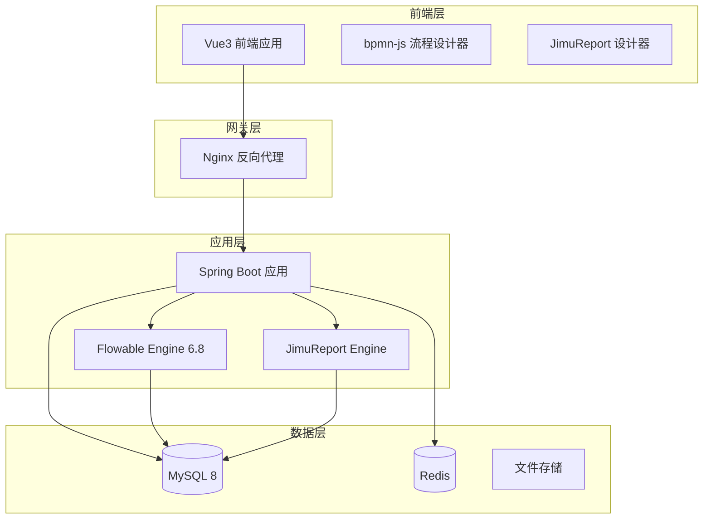
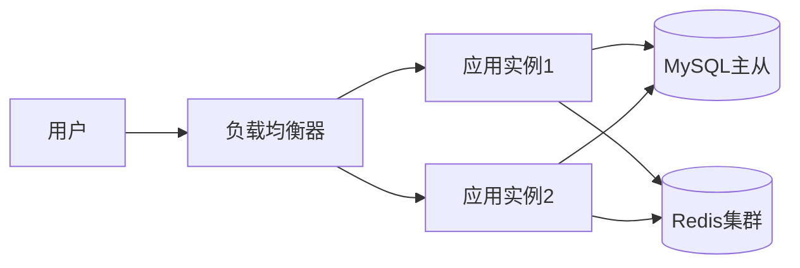

# 基于RuoyiFlowableJimu的应用开发平台

需求名称：2026-03-29-ruoyi-flowable-jimu
更新日期：2026-03-29
版本：v1.0.0

## 概述

### 项目背景

本项目基于 RuoYi-Vue-Plus 5.6.0 框架，整合 Flowable 6.8 工作流引擎和积木报表（JimuReport）组件，构建一个集成了可视化流程建模和可视化报表配置功能的通用应用软件开发平台。

RuoYi-Vue-Plus 是若依框架的全面升级版本，专注于分布式集群和多租户场景，采用 Vue3、TypeScript、ElementPlus 构建。Flowable 是流行的开源工作流引擎，支持 BPMN、CMMN、DMN 标准。积木报表（JimuReport）是国产免费报表工具，提供可视化报表设计能力。

### 设计目标

1. **可视化流程建模** - 基于 bpmn-js 实现浏览器端流程设计器
2. **可视化报表配置** - 集成积木报表，提供拖拽式报表设计
3. **低代码配置开发** - 通过配置而非编码实现业务功能
4. **模块化架构** - 核心功能与业务功能解耦，便于扩展

---

## 技术架构

### 技术栈选型

| 组件 | 技术 | 版本 |
|------|------|------|
| 基础框架 | RuoYi-Vue-Plus | 5.6.0 |
| 流程引擎 | Flowable | 6.8.0 |
| 流程设计器 | bpmn-js | 17.9.0 |
| 报表组件 | JimuReport | 1.9.0 |
| 后端 | Spring Boot + MyBatis-Plus | Boot 3.5.12 |
| 前端 | Vue3 + Element Plus + Vite | Vue 3.4 |
| 数据库 | MySQL | 8.0 |
| 缓存 | Redis | 7.x |

### 系统架构图



### 模块划分

```
ruoyi-flowable-jimu/
├── java/                        # 后端项目
│   ├── ruoyi-admin/            # Web服务入口
│   ├── ruoyi-common/           # 公共模块
│   │   ├── ruoyi-common-core/  # 核心工具类
│   │   ├── ruoyi-common-mybatis/ # 数据访问
│   │   ├── ruoyi-common-security/ # 安全模块
│   │   └── ...
│   ├── ruoyi-modules/          # 业务模块
│   │   ├── ruoyi-system/      # 系统管理模块
│   │   ├── ruoyi-workflow/     # WarmFlow工作流(原有)
│   │   ├── ruoyi-flowable/     # Flowable工作流模块(新增)
│   │   └── ruoyi-report/       # 积木报表模块(新增)
│   └── pom.xml
│
├── ruoyi-ui/                    # 前端项目
│   ├── src/
│   │   ├── views/              # 页面视图
│   │   │   ├── login/         # 登录页面
│   │   │   ├── index/         # 首页
│   │   │   ├── system/         # 系统管理
│   │   │   ├── workflow/       # 流程管理
│   │   │   │   ├── designer/  # 流程设计器(bpmn-js)
│   │   │   │   ├── definition/ # 流程定义
│   │   │   │   ├── instance/  # 流程实例
│   │   │   │   └── task/       # 任务管理
│   │   │   ├── report/         # 报表中心
│   │   │   ├── monitor/        # 系统监控
│   │   │   └── tool/           # 系统工具
│   │   ├── layout/            # 布局组件
│   │   ├── router/            # 路由配置
│   │   ├── store/              # 状态管理
│   │   ├── api/                # API接口
│   │   └── utils/              # 工具函数
│   └── package.json
│
└── README.md
```

---

## 功能特性

### 1. 流程管理模块

#### 1.1 流程设计器（bpmn-js）

| 功能 | 说明 |
|------|------|
| 拖拽建模 | 支持通过拖拽创建流程元素 |
| 元素面板 | 开始事件、结束事件、用户任务、服务任务、网关等 |
| 属性配置 | 支持配置流程属性和元素属性 |
| XML 导入导出 | 支持 BPMN XML 格式导入导出 |
| 流程部署 | 支持直接部署设计的流程 |

#### 1.2 流程定义管理

| 功能 | 说明 |
|------|------|
| 流程列表 | 查看所有已部署的流程定义 |
| 版本管理 | 支持同一流程的多个版本 |
| 激活/挂起 | 支持动态切换流程状态 |
| 流程图查看 | 查看流程 BPMN 图 |

#### 1.3 流程实例管理

| 功能 | 说明 |
|------|------|
| 实例列表 | 查看正在运行的流程实例 |
| 实例监控 | 查看实例执行状态 |
| 实例取消 | 支持取消进行中的实例 |

#### 1.4 任务管理

| 功能 | 说明 |
|------|------|
| 待办任务 | 查看当前用户待办任务 |
| 已办任务 | 查看已处理的任务记录 |
| 任务签收 | 支持任务签收 |
| 任务办理 | 支持完成任务 |

### 2. 报表中心模块

#### 2.1 报表管理

| 功能 | 说明 |
|------|------|
| 报表列表 | 查看所有报表 |
| 报表预览 | 预览报表效果 |
| 报表设计 | 调用积木报表设计器 |

#### 2.2 积木报表集成

| 功能 | 说明 |
|------|------|
| 可视化设计 | 拖拽式报表设计 |
| 图表支持 | 支持折线图、柱状图、饼图等 |
| 数据源配置 | 支持多数据源配置 |
| 打印导出 | 支持 Excel、PDF、Word 导出 |

### 3. 系统管理模块

| 功能 | 说明 |
|------|------|
| 用户管理 | 用户 CRUD、状态管理 |
| 角色管理 | 角色权限分配、数据权限 |
| 菜单管理 | 动态菜单、按钮权限 |
| 部门管理 | 组织架构、树形结构 |
| 岗位管理 | 岗位序列、岗位人员 |
| 字典管理 | 字典类型和数据维护 |
| 参数管理 | 系统参数配置 |
| 多租户 | 多租户数据隔离 |

### 4. 系统监控模块

| 功能 | 说明 |
|------|------|
| 在线用户 | 查看当前在线用户 |
| 操作日志 | 记录用户操作行为 |
| 登录日志 | 记录用户登录信息 |

### 5. 系统工具模块

| 功能 | 说明 |
|------|------|
| 表单构建 | 可视化表单设计（预留） |
| 代码生成 | 基于数据库表的代码生成（预留） |

---

## 组件与接口

### Flowable 配置

```java
@Configuration
public class FlowableConfig {
    @Bean
    public SpringProcessEngineConfiguration processEngineConfiguration(
            DataSource dataSource, 
            PlatformTransactionManager transactionManager) {
        SpringProcessEngineConfiguration config = new SpringProcessEngineConfiguration();
        config.setDataSource(dataSource);
        config.setTransactionManager(transactionManager);
        config.setDatabaseSchemaUpdate("true");
        config.setAsyncExecutorActivate(true);
        config.setHistory("full");
        return config;
    }
}
```

### 核心 API

#### 流程管理 API

| 接口 | 方法 | 说明 |
|------|------|------|
| `/flowable/process/definition/list` | GET | 流程定义列表 |
| `/flowable/process/definition/deploy` | POST | 部署流程定义 |
| `/flowable/process/instance/start` | POST | 启动流程实例 |
| `/flowable/process/task/todo/list` | GET | 待办任务列表 |
| `/flowable/process/task/complete` | POST | 完成任务 |

#### 报表管理 API

| 接口 | 方法 | 说明 |
|------|------|------|
| `/report/list` | GET | 报表列表 |
| `/report/{id}` | GET | 报表详情 |
| `/report/preview/{id}` | GET | 报表预览 |

---

## 数据模型

### Flowable 核心表（30张）

| 表名前缀 | 说明 |
|----------|------|
| ACT_GE_* | 通用数据表 |
| ACT_RU_* | 运行时数据表 |
| ACT_HI_* | 历史数据表 |
| ACT_RE_* | 流程存储表 |
| ACT_PROCDEF_INFO | 流程定义信息 |

### 自定义业务表

```sql
-- 流程模型扩展表
CREATE TABLE sys_flow_model (
    model_id VARCHAR(64) PRIMARY KEY,
    model_key VARCHAR(255) NOT NULL,
    model_name VARCHAR(255) NOT NULL,
    model_category VARCHAR(255),
    model_content LONGTEXT,
    description VARCHAR(1000),
    version INT DEFAULT 1,
    tenant_id BIGINT DEFAULT 0,
    create_by VARCHAR(64),
    create_time DATETIME,
    update_by VARCHAR(64),
    update_time DATETIME
);

-- 报表配置表
CREATE TABLE sys_report_config (
    report_id VARCHAR(64) PRIMARY KEY,
    report_code VARCHAR(100) NOT NULL,
    report_name VARCHAR(255) NOT NULL,
    report_type VARCHAR(20),
    data_source_id VARCHAR(64),
    template_content LONGTEXT,
    status CHAR(1) DEFAULT '0',
    tenant_id BIGINT DEFAULT 0,
    create_by VARCHAR(64),
    create_time DATETIME
);
```

---

## 部署架构

### 开发环境

```yaml
# docker-compose.yml
version: '3.8'
services:
  mysql:
    image: mysql:8.0
    environment:
      MYSQL_ROOT_PASSWORD: root123
      MYSQL_DATABASE: ruoyi_flowable
  redis:
    image: redis:7-alpine
  app:
    build: .
    ports:
      - "8080:8080"
    depends_on:
      - mysql
      - redis
```

### 生产环境



---

## 快速开始

### 后端启动

```bash
cd java
mvn clean install -DskipTests
cd ruoyi-admin
java -jar target/ruoyi-admin.jar
```

### 前端启动

```bash
cd ruoyi-ui
npm install
npm run dev
```

### 访问地址

- 前端：http://localhost:3000
- 后端：http://localhost:8080
- 接口文档：http://localhost:8080/swagger-ui.html

---

## 引用链接

[^1]: RuoYi-Vue-Plus - https://gitee.com/dromara/RuoYi-Vue-Plus

[^2]: Flowable 官方文档 - https://flowable.com/open-source/docs/

[^3]: bpmn-js 官方文档 - https://bpmn.io/toolkit/bpmn-js/

[^4]: 积木报表 JimuReport - https://www.jimureport.com/
